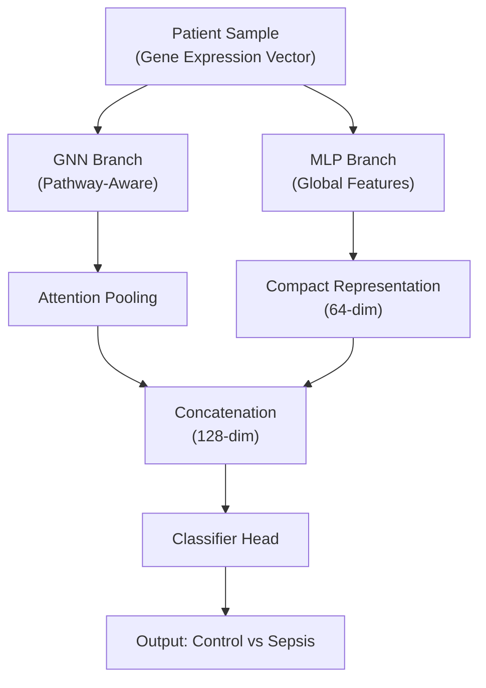
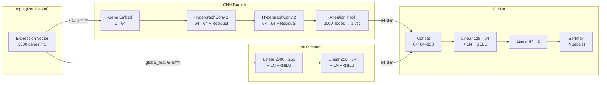

# Hybrid V4 Model Architecture Specification
## `hybrid_v4_Hybrid_Pw_STR`

---

## 1. Overview

The **Hybrid V4** model is a dual-branch architecture that combines a **Hypergraph Neural Network (HGCN)** with a **Multi-Layer Perceptron (MLP)** for neonatal sepsis classification from gene expression data. The GNN branch captures pathway-level biological interactions via hypergraph convolutions, while the MLP branch directly processes the full expression vector (similar to Logistic Regression). The two branches are fused before a final classifier head.



---

## 2. Data Specifications

### 2.1 Source Datasets

| Dataset | Platform(s) | Samples | Control | Sepsis |
|---------|-------------|---------|---------|--------|
| **GSE25504_Affy** | Affymetrix HG-U133 | 5 | 3 | 2 |
| **GSE25504_Illu** | Illumina HumanRef-8 | 83 | 41 | 42 |
| **GSE25504_NCode** | NCode Human miRNA | 82 | 57 | 25 |
| **GSE69686** | Illumina HumanHT-12 | 149 | 85 | 64 |
| **Total** | — | **319** | **186** | **133** |

### 2.2 Data Preprocessing Pipeline

1. **Raw Data:** GEO SOFT files → gene-level expression via platform-specific probe annotations
2. **Gene Symbol Mapping:** Multi-platform extraction with per-GPL probe-to-gene mapping
3. **Batch Correction:** Parametric ComBat (via `pycombat`) aligning batch means/variances while preserving biological signal. Condition labels used as covariates to protect disease-related variation
4. **Gene Selection:** Top **2,000 genes** ranked by **Median Absolute Deviation (MAD)** across all 319 samples. This captures the most variable (and likely most biologically informative) genes
5. **Output Files:**
   - `expression_combat_v2.csv` — Full ComBat-corrected expression matrix (all genes × 319 samples)
   - `metadata_v2.csv` — Sample metadata (SampleID, Condition, Batch)

### 2.3 Tier-1 Biomarkers of Interest

10 known neonatal sepsis biomarkers tracked for interpretability:

`FCGR1A`, `MMP9`, `S100A8`, `S100A9`, `TLR4`, `MYD88`, `IL6`, `CXCL8`, `MPO`, `CEACAM8`

---

## 3. Graph Construction

### 3.1 Node Definition

Each gene in the top-2,000 MAD list becomes a **node** in the graph.

| Property | Value |
|----------|-------|
| **Number of Nodes** | 2,000 (one per gene) |
| **Node Feature** | Scalar expression value (shape: `[1]`) |
| **Node Embedding** | `Linear(1 → 64) → LayerNorm → GELU` |

Each patient produces a **separate graph instance** with the same topology (same edges) but different node features (that patient's expression values for the 2,000 genes).

### 3.2 Hyperedge Construction (Dual Source)

The graph uses a **hypergraph** structure with two sources of edges. Unlike standard graphs (where edges connect exactly 2 nodes), **hyperedges connect groups of nodes** — making them ideal for representing biological pathways where multiple genes participate simultaneously.

#### Source 1: KEGG Pathway Hyperedges

- **Database:** KEGG_2021_Human (via `gseapy`)
- **Inclusion Criteria:** Pathway must overlap with ≥ 3 genes from the top-2,000 gene list
- **Count:** ~282 pathway hyperedges
- **Mechanism:** Each KEGG pathway becomes one hyperedge connecting all its member genes present in the top-2,000 list

**Example:**
```
Pathway: "Toll-like receptor signaling pathway"
Hyperedge connects: [TLR2, TLR4, MYD88, IL1B, MAPK14, PIK3CB, AKT2, ...]
```

#### Source 2: STRING PPI Pairwise Edges

- **Database:** STRING protein-protein interaction network (`data/processed/ppi_network.csv`)
- **Score Threshold:** ≥ 700 (high confidence)
- **Count:** ~2,870 pairwise edges
- **Mechanism:** Each PPI edge (gene A ↔ gene B) becomes a **size-2 hyperedge** connecting those two gene nodes

**Example:**
```
STRING Edge: MMP9 ↔ MMP8 (score=924)
Hyperedge connects: [MMP9, MMP8]
```

#### Combined Hypergraph Summary

| Component | Count | Type |
|-----------|-------|------|
| **Pathway Hyperedges** | ~282 | Group (3–40+ genes each) |
| **STRING Pairwise Edges** | ~2,870 | Pair (2 genes each) |
| **Total Hyperedges** | ~3,152 | Mixed |
| **Nodes** | 2,000 | One per gene |

### 3.3 Hyperedge Index Format

The hypergraph is stored as a `[2, E]` tensor (`hyperedge_index`) in PyTorch Geometric format:

```
Row 0: [node_id, node_id, node_id, ...]   ← which gene node
Row 1: [hedge_id, hedge_id, hedge_id, ...]  ← which hyperedge it belongs to
```

This index is **shared across all patient graphs** (same topology, different node features).

### 3.4 Per-Patient Graph Instance

```
Data(
    x          = [2000, 1]        # Per-node expression values (GNN input)
    y          = scalar           # 0 = Control, 1 = Sepsis
    hyperedge_index = [2, ~E]    # Shared hypergraph structure
    global_feat = [1, 2000]      # Full expression vector (MLP input)
    batch_label = str             # e.g. "GSE25504_Illu"
    sample_id   = str             # e.g. "GSM627050"
)
```

---

## 4. Model Architecture

### 4.1 GNN Branch

Processes per-node gene features through the hypergraph structure.

```
Input: x ∈ ℝ^(2000×1)
    ↓
Gene Embedding: Linear(1→64) → LayerNorm(64) → GELU
    ↓  → g ∈ ℝ^(2000×64)
HypergraphConv Layer 1: HypergraphConv(64→64) → LayerNorm → GELU → Dropout(0.3)
    ↓  + Residual Connection (g = g + h)
HypergraphConv Layer 2: HypergraphConv(64→64) → LayerNorm → GELU → Dropout(0.3)
    ↓  + Residual Connection (g = g + h)
Attention Pooling: 2000 node embeddings → 1 graph embedding
    ↓
Output: gnn_out ∈ ℝ^(64)
```

**HypergraphConv** (from PyTorch Geometric): Performs message passing over hyperedges. Each node aggregates information from all hyperedges it participates in, and each hyperedge aggregates from all its member nodes. This enables pathway-level information flow.

**Attention Pooling:** Learns importance weights per node via a gated attention mechanism:
```
score_i = Tanh(Linear(h_i)) → Linear → scalar
weight_i = softmax(score_i)  (per-graph stable softmax)
graph_embedding = Σ weight_i × h_i
```

### 4.2 MLP Branch

Processes the full 2,000-dimensional expression vector directly (bypassing graph structure).

```
Input: global_feat ∈ ℝ^(2000)
    ↓
Linear(2000→256) → LayerNorm(256) → GELU → Dropout(0.3)
    ↓
Linear(256→64) → LayerNorm(64) → GELU
    ↓
Output: mlp_out ∈ ℝ^(64)
```

### 4.3 Fusion & Classifier

Concatenates both branch outputs and classifies.

```
Input: [gnn_out ∥ mlp_out] ∈ ℝ^(128)
    ↓
Linear(128→64) → LayerNorm(64) → GELU → Dropout(0.3)
    ↓
Linear(64→2)
    ↓
Output: logits ∈ ℝ^(2)  →  softmax  →  P(Control), P(Sepsis)
```

### 4.4 Parameter Count (Approximate)

| Component | Parameters |
|-----------|------------|
| Gene Embedding (1→64 + LN) | ~192 |
| HypergraphConv×2 + LN×2 | ~16,640 |
| Attention Pool | ~2,145 |
| MLP Branch (2000→256→64) | ~528,832 |
| Fusion Classifier (128→64→2) | ~8,450 |
| **Total** | **~556,259** |

---

## 5. Training Configuration

### 5.1 Hyperparameters

| Parameter | Value |
|-----------|-------|
| **Optimizer** | AdamW |
| **Learning Rate** | 3 × 10⁻⁴ |
| **Weight Decay** | 5 × 10⁻⁴ |
| **LR Scheduler** | CosineAnnealingLR (η_min = 1×10⁻⁶) |
| **Epochs** | 300 (V4) / 150 (V6 Simple Split) |
| **Batch Size** | 16 |
| **Dropout** | 0.3 |
| **Early Stopping Patience** | 50 (V4) / 30 (V6) |
| **Min Epochs** | 80 (V4) / None (V6) |
| **Gradient Clipping** | Max norm = 1.0 |
| **Loss Function** | CrossEntropyLoss |
| **Threshold Selection** | Youden's J (argmax TPR−FPR) |

### 5.2 Data Augmentation (On-the-Fly)

| Augmentation | Rate | Description |
|--------------|------|-------------|
| **Hyperedge Dropout** | 5% | Randomly removes hyperedges during training |
| **Gaussian Noise** | σ = 0.02 | Added to both per-node features and global expression vector |

### 5.3 Evaluation

| Mode | Description |
|------|-------------|
| **5-Fold Stratified CV** | Standard (stratified by Condition), inflated metric |
| **LOBO (Leave-One-Batch-Out)** | Honest cross-batch generalization metric |
| **Simple 80/20 Split** | Traditional pipeline (V6), stratified by Condition |

---

## 6. Architecture Diagram



---

## 7. Key Design Decisions

| Decision | Rationale |
|----------|-----------|
| **Hybrid GNN+MLP** | GNN alone (AUROC ~0.68) cannot match LR (~0.82) because scalar node features lose multivariate signal. MLP branch recovers this. |
| **Hypergraph (not standard graph)** | Biological pathways are multi-gene, not pairwise. Hypergraph convolution is the natural representation. |
| **KEGG + STRING** | KEGG provides curated pathway biology (group-level). STRING provides empirical protein interactions (pair-level). Together, they capture both high-level and fine-grained gene relationships. |
| **MAD-based gene selection** | Top 2,000 by Median Absolute Deviation selects genes with highest variation — most likely to carry discriminative signal. |
| **Attention Pooling** | Learns which gene nodes are most important for classification, enabling interpretability via attention weights. |
| **Residual Connections** | Prevents over-smoothing in GNN layers (critical for shallow 2-layer networks). |
| **ComBat Batch Correction** | Aligns multi-platform data (Affymetrix, Illumina) to reduce technical variation while preserving biological signal. |

---

## 8. File References

| File | Purpose |
|------|---------|
| [12_train_hybrid_v4.py](file:///c:/Users/csath/Downloads/ppi_gnn_combined_dataset/CH_DANN_Plan/scripts/12_train_hybrid_v4.py) | V4 training script (5-fold CV) |
| [14_train_v6_simple_split.py](file:///c:/Users/csath/Downloads/ppi_gnn_combined_dataset/CH_DANN_Plan/scripts/14_train_v6_simple_split.py) | V6 simple train/test split |
| [13_train_v5_lobo_dann.py](file:///c:/Users/csath/Downloads/ppi_gnn_combined_dataset/CH_DANN_Plan/scripts/13_train_v5_lobo_dann.py) | V5 LOBO evaluation + DANN |
| [expression_combat_v2.csv](file:///c:/Users/csath/Downloads/ppi_gnn_combined_dataset/CH_DANN_Plan/results/expression_combat_v2.csv) | ComBat-corrected expression matrix |
| [metadata_v2.csv](file:///c:/Users/csath/Downloads/ppi_gnn_combined_dataset/CH_DANN_Plan/results/metadata_v2.csv) | Sample metadata |
| [pathway_info_v2.json](file:///c:/Users/csath/Downloads/ppi_gnn_combined_dataset/CH_DANN_Plan/results/pathway_info_v2.json) | KEGG pathway → gene mappings used |
| [gene_list_v2.json](file:///c:/Users/csath/Downloads/ppi_gnn_combined_dataset/CH_DANN_Plan/results/gene_list_v2.json) | Top 2,000 MAD genes |
| [ppi_network.csv](file:///c:/Users/csath/Downloads/ppi_gnn_combined_dataset/data/processed/ppi_network.csv) | STRING PPI edges |
